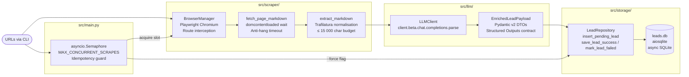

# B2B Lead Enrichment & Scoring Agent

[](https://github.com/Nazar-Plokhuta/lead-enrichment-agent/actions/workflows/ci.yml)    [](https://github.com/Nazar-Plokhuta/lead-enrichment-agent/releases)

A high-performance, fully asynchronous pipeline that crawls target company domains, extracts semantic Markdown, and computes deterministic ICP fit scores using LLM Structured Outputs.  Results are persisted to SQLite with full audit trails, idempotency guarantees, and bounded concurrency.

---

## Architecture



**Data flow summary**:

```
CLI URLs
  └──► asyncio.Semaphore (concurrency gate)
        └──► Playwright Chromium  (headless, asset-blocked)
              └──► Trafilatura     (HTML → clean Markdown)
                    └──► OpenAI Structured Outputs  (Markdown → EnrichedLeadPayload)
                          └──► aiosqlite            (validated payload → leads.db)
```

---

## Key Technical Features

### Fully Asynchronous I/O

Every network and database operation runs on the asyncio event loop with no blocking calls.  Playwright's `async_api`, the `openai.AsyncOpenAI` client, and `aiosqlite` are used throughout.  `asyncio.gather` fans out all URL tasks in parallel, bounded by a shared `asyncio.Semaphore` to prevent browser-process exhaustion and OpenAI rate-limit violations.

### Strict Schema Validation — Zero Raw JSON Parsing

The extraction contract is defined as a Pydantic v2 model hierarchy (`EnrichedLeadPayload`) and passed directly to `client.beta.chat.completions.parse` as the `response_format`.  The OpenAI SDK injects the JSON schema into the API call and validates the model response before returning a typed Python object.  There are no calls to `json.loads()`, no dict-to-model coercion steps, and no secondary validation passes anywhere in the codebase.

### Resilient Resource Management

| Mechanism | Implementation |
|---|---|
| Asset blocking | Context-level Playwright route interception aborts `image`, `media`, `font`, and `stylesheet` requests before they are fetched. |
| Anti-hang timeout | `domcontentloaded` wait strategy with a hard `PAGE_TIMEOUT_MS` ceiling; never waits for analytics beacons or SSE streams to close. |
| Zombie prevention | `BrowserManager.__aexit__` closes context → browser → Playwright driver in dependency order with independent `try/finally` blocks. |
| Error isolation | Domain exceptions (`ScrapeError`, `LLMExtractionError`) insulate the orchestrator from Playwright and OpenAI SDK internals. |

### Concurrency & Idempotency Control

`asyncio.Semaphore(MAX_CONCURRENT_SCRAPES)` bounds the number of live browser contexts and simultaneous OpenAI requests.  The idempotency check (`get_lead_by_url`) runs *before* semaphore acquisition so that already-processed URLs consume zero concurrency slots.  `INSERT OR IGNORE` on the `url` UNIQUE constraint eliminates the TOCTOU race when concurrent tasks attempt to insert the same URL simultaneously.

---

## Project Structure

```
lead-enrichment-agent/
├── src/
│   ├── config.py              # BaseSettings singleton (pydantic-settings)
│   ├── main.py                # Async CLI orchestrator
│   ├── core/
│   │   └── exceptions.py      # Domain exception hierarchy
│   ├── scraper/
│   │   ├── browser.py         # Playwright Chromium lifecycle & route interception
│   │   ├── fetcher.py         # Page navigation, wait strategy, error mapping
│   │   └── cleaner.py         # HTML → Markdown via trafilatura
│   ├── llm/
│   │   ├── schemas.py         # Pydantic v2 DTOs (Structured Outputs contract)
│   │   ├── prompts.py         # Versioned ICP rubric & prompt templates
│   │   └── client.py          # AsyncOpenAI wrapper
│   └── storage/
│       ├── database.py        # Schema DDL, init_db, connection context manager
│       └── repository.py      # CRUD against the leads table
├── docs/
│   └── internal/
│       ├── architecture.md    # High-level design specification
│       └── state.md           # Current implementation state & decision log
├── .env.example               # Environment variable reference
└── requirements.txt           # Pinned runtime dependencies
```

---

## Setup & Quickstart

### Prerequisites

- **Python 3.11+**
- **Playwright Chromium** (installed separately from the Python package)

### 1. Clone and install dependencies

```bash
git clone <repo-url>
cd lead-enrichment-agent
pip install -r requirements.txt
python -m playwright install chromium
```

### 2. Configure the environment

Copy `.env.example` to `.env` and fill in real values:

```bash
cp .env.example .env
```

`.env.example` reference:

```ini
OPENAI_API_KEY=sk-replace-me

# Optional overrides (defaults shown)
OPENAI_MODEL=gpt-4o-mini
# OPENAI_BASE_URL=https://openrouter.ai/api/v1   # uncomment to use OpenRouter
DATABASE_PATH=leads.db
MAX_CONCURRENT_SCRAPES=3
PAGE_TIMEOUT_MS=20000
LOG_LEVEL=INFO
```

Setting `OPENAI_BASE_URL` routes all LLM calls through any OpenAI-compatible
endpoint (OpenRouter, Azure proxy, LM Studio) without code changes.

### 3. Run the pipeline

```bash
# Enrich one or more company URLs
python -m src.main https://linear.app https://vercel.com

# Re-enrich URLs that were already processed
python -m src.main https://linear.app --force
```

**CLI options**:

| Argument | Description |
|---|---|
| `URL [URL ...]` | One or more fully-qualified company URLs to enrich. |
| `--force` | Re-enrich URLs already in `PROCESSED` state; without this flag they are skipped. |

**Console output on completion**:

As of **v1.1.0**, the agent renders a fully styled terminal experience powered by [`rich`](https://github.com/Textualize/rich):

- **Coloured telemetry logs** — each pipeline stage (scrape → extract → persist) is printed with severity-coloured prefixes and structured context (URL, elapsed time, status).
- **Live execution status** — a `rich` live display tracks in-flight tasks in real time, showing which URLs are currently being scraped or scored.
- **Native summary table** — on completion, a formatted table is printed with per-URL outcomes (company name, fit score, fit tier, status), followed by aggregate counters for enriched, failed, and skipped records.

<!-- Terminal demo recording -->


### 4. Query results

```bash
sqlite3 leads.db "SELECT url, company_name, fit_score, fit_tier, status FROM leads ORDER BY fit_score DESC;"
```

---

## Example Output

Verified enrichment result for **[linear.app](https://linear.app)** — a B2B SaaS
product-development tool:

```json
{
  "company_name": "Linear",
  "analysis": {
    "industry": "B2B SaaS – Product Development Tools",
    "target_audience": "Modern product teams (10–500 employees)",
    "value_proposition": "Linear is a purpose-built product development system designed for modern teams, integrating AI workflows to streamline planning and building products.",
    "pain_points": [
      "Streamlining product planning and building processes",
      "Aligning teams with product initiatives and strategic roadmaps",
      "Automating issue routing and prioritization based on customer feedback"
    ]
  },
  "scoring": {
    "fit_tier": "Tier 1 (High)",
    "fit_score": 85,
    "scoring_rationale": "Linear operates as a B2B SaaS company focused on product development tools, which aligns with our ICP. The page indicates a dedicated focus on modern teams and AI workflows, suggesting a tech-enabled service model. The absence of employee count is noted, but the product's focus on teams implies a likely fit within the 10–500 employee range. The presence of features like automations and integrations indicates a strong product-led growth pattern. There are no disqualifying factors present, and the value proposition is clearly articulated.",
    "missing_information": [
      "Employee count not mentioned"
    ]
  },
  "outreach": {
    "icebreaker": "I noticed that Linear is designed for modern teams with AI workflows at its core, which is a game-changer for product development.",
    "suggested_angle": "Given Linear's focus on streamlining product planning and building processes, our solution could enhance your existing workflows by providing additional automation and integration capabilities that further optimize team collaboration."
  }
}
```

**Score breakdown**: 85/100 → Tier 1 (High).  One penalty applied for the
missing employee count signal; all other ICP criteria (B2B SaaS, product-led
growth patterns, integrations/API, named growth-stage customers) confirmed from
page evidence.

---

## ICP Scoring Rubric

| Score Range | Tier | Interpretation |
|---|---|---|
| 75 – 100 | Tier 1 (High) | Strong ICP fit; prioritise for immediate outreach. |
| 50 – 74 | Tier 2 (Medium) | Partial fit; engage with qualification questions. |
| 25 – 49 | Tier 3 (Low) | Weak fit; defer or monitor. |
| 0 – 24 | Disqualified | Does not meet ICP criteria (B2C, NGO, sole trader, enterprise, etc.). |

Scoring is deterministic by rubric: `scoring_rationale` is generated first as a
chain-of-thought scratchpad; `fit_score` and `fit_tier` are assigned only after
the rationale is complete.  Each entry in `missing_information` carries a
quantified score penalty defined in the system prompt.

---

## Technology Stack

| Layer | Library | Version |
|---|---|---|
| Async runtime | `asyncio` (stdlib) | Python 3.11+ |
| Web scraping | `playwright` | ≥ 1.44.0 |
| HTML normalisation | `trafilatura` | ≥ 2.0.0 |
| LLM client | `openai` | ≥ 1.30.0 |
| Schema validation | `pydantic` | ≥ 2.7.0 |
| Settings | `pydantic-settings` | ≥ 2.3.0 |
| Persistence | `aiosqlite` | ≥ 0.20.0 |
| CLI & Formatting | `rich` | ≥ 13.7.0 |
